# Docker Image Publishing

GitHub предоставляет две возможности публиковать образы:

1. GitHub Packages
1. GitHub Container Registry

Первый вариант позволяет публиковать образы в привязке к репо, но для доступа к ним нужно будет аутентифицировать клиент
Docker (что неудобно).

Второй вариант позволяет публиковать публичные образы (на весь ваш аккаунт) и для доступа к ним не понадобиться
аутентифицировать клиент (т.е. можно скачивать как публичные образы с DockerHub).

## Шаг 1. Поработаем за Maven

На лекции мы написали демо-приложение следующего вида:

```java
import java.io.IOException;
import java.io.OutputStream;
import java.net.ServerSocket;
import java.net.Socket;

public class Main {
  public static void main(String[] args) {
    try (
        ServerSocket serverSocket = new ServerSocket(9999); // ctrl + alt + v
    ) {
      while (true) {
        try (
            Socket socket = serverSocket.accept(); // пришёл клиент
        ) {
          OutputStream outputStream = socket.getOutputStream();
          String message = "Hello world";

          outputStream.write((
              "HTTP/1.1 200 OK\r\n" +
                  "Content-Type: text/plain\r\n" +
                  "Content-Length: " + message.length() + "\r\n" +
                  "Connection: close\r\n" +
                  "\r\n" +
                  message
          ).getBytes());
        } catch (IOException e) {
          e.printStackTrace();
        }
      }
    } catch (IOException e) {
      e.printStackTrace();
    }
  }
}
```

Пока мы работаем без Maven/Gradle (но скоро дойдём и до них), для нас запуск приложения состоит из двух этапов:

1. Компиляция из *.java в *.class с помощью javac
1. Запуск *.class с помощью java

Как это выглядит в командной строке (компиляция):

```shell
javac src/Main.java
```

Запуск:

```shell
java Main
```

Обратите внимание: не `java Main.class`, а `java Main`.

Соответственно, именно это нам и нужно сделать с помощью Docker:

1. Скомпилировать приложение
1. Создать образ, который будет запускать наше приложение (при запуске контейнера из нашего образа)

## Шаг 2. Единый образ

Общая идея: мы создаём Dockerfile, в котором описываем, как компилировать наше приложение (не запускать, а
компилировать), чтобы в результате создания образа получить в этом образе скомпилированный `Main.class`, готовый для
запуска.

1. Создаём Dockerfile, в котором:
    1. Берём за основу образ [OpenJDK](https://hub.docker.com/_/openjdk)
    1. Кладём туда наши исходники
    1. Запускаем `javac`
1. Собираем свой образ с помощью Docker

Пишем Dockerfile:

```dockerfile
FROM openjdk:11
COPY src/Main.java .
RUN javac Main.java
CMD ["java", "Main"]
```

Описание:

* `FROM` - базовый образ (т.е. в процессе сборки нашего образа скачается базовый образ, из него создастся контейнер и
  там будут производиться все дальнейшие действия*)
* `COPY` - копирование файлов из текущего каталога (в котором будет запускаться команда `docker image build`) внутрь
  будущего образа (`.` внутрь текущего рабочего каталога, который установлен родительским образом, пока делаем так,
  потом пройдём `WORKDIR`)
* `RUN` - запуск команды на этапе сборки образа (т.е. в момент, когда будем запускать `docker image build`)
* `CMD` - какую команду запускать в контейнере, но уже в том, который мы будем запускать из образа, который получим из
  нашего Dockerfile

Примечание*: конечно же не совсем все. Но в случае именно такого Dockerfile - все.

[Документация на Dockerfile](https://docs.docker.com/engine/reference/builder/).

Сборка образа:

```shell
docker image build . -t student/tsrv:v1
```

Запуск контейнера из образа (как раз будет запущено то, что написано в `CMD`):

```shell
docker container run -p 9999:9999 student/tsrv:v1
```

Для выхода завершения работы контейнера нажмите `Ctrl + C`, либо выполните
команду `docker container stop <container_id>` в другом терминале.

[Документация на команды Docker](https://docs.docker.com/engine/reference/commandline/docker/).

## Шаг 3. Multi-stage

**Q**: чем плох полученный нами Dockerfile?

**A**: тем, что в нём есть "мусор". А именно: если вы запустите
команду `docker container run -it student/tsrv:v1 /bin/bash` и выполните команду `ls`, то у видите, что в полученном
образе хранятся и исходники. Экстраполируя это на реальные процессы сборки, мы получим, что все промежуточные файлы
сборки + все инструменты сборки (например, тот же Maven) будут хранится в образе (а значит, и в запускаемом из образа
контейнере, что нам совсем не нужно).

Поэтому мы можем организовать [Multi-stage build](https://docs.docker.com/develop/develop-images/multistage-build/) (
сборку в несколько этапов).

Редактируем существующий Dockerfile:

```dockerfile
FROM openjdk:11 AS build
COPY src/Main.java .
RUN javac Main.java

FROM openjdk:11
COPY --from=build Main.class .
CMD ["java", "Main"]
```

**Q**: что поменялось?

**A**: теперь сборка нашего образа проходит в два этапа (stage):

1. Мы берём образ openjdk:11 и компилируем в нём* (Main.java -> Main.class) и называем этот stage `build` (
   строка `AS build`)
1. Мы снова берём образ openjdk:11 и в него копируем файл Main.class, который у нас хранится в stage `build`

Таким образом получается, что в итоговом образе у нас будет всё, что есть в `openjdk:11` + файл `Main.class`.

Примечание*: на самом деле из этого образа запускаем контейнер и в нём компилируем, но поскольку мы это уже обсуждали,
дальше эти детали указывать не будем.

Сборка образа (поскольку мы используем тот же тег, то существующий образ просто заменится):

```shell
docker image build . -t student/tsrv:v1
```

Запуск контейнера из образа (как раз будет запущено то, что написано в `CMD`):

```shell
docker container run -p 9999:9999 student/tsrv:v1
```

Можете запустить контейнер с изменённой командой запуска: `docker container run -it student/tsrv:v1 /bin/bash` (
вместо `java Main` будет запущен `/bin/bash`) и с помощью команды `ls` убедиться, что никакого Main.java там больше нет.

Либо можно подключиться к уже запущенному с помощью команды `docker container exec -it <container_id> /bin/bash` (
узнать `id` можно с помощью `docker container ls`).

### Maven/Gradle

Для работы с Maven/Gradle ситуация аналогична, но:

1\. В качестве сборочного образа берётся Docker образ Maven или Gradle:

```Dockerfile
FROM maven:3-openjdk-15-slim AS build
WORKDIR /app/build
COPY . .
RUN mvn package -B
RUN mv target/http-server-1.0-jar-with-dependencies.jar target/app.jar

FROM openjdk:17-slim
WORKDIR /app/bin
COPY --from=build /app/build/target/app.jar .
CMD ["java", "-jar", "app.jar"]
```

2\. Желательно сразу упаковывать всё в Uber JAR, например, в Maven с помощью Assembly Plugin:

```xml
    <build>
        <plugins>
            <plugin>
                <artifactId>maven-assembly-plugin</artifactId>
                <version>3.3.0</version>
                <executions>
                    <execution>
                        <phase>package</phase>
                        <goals>
                            <goal>single</goal>
                        </goals>
                    </execution>
                </executions>
                <configuration>
                    <archive>
                        <manifest>
                            <mainClass>tech.itpark.http.Main</mainClass>
                        </manifest>
                    </archive>
                    <descriptorRefs>
                        <descriptorRef>jar-with-dependencies</descriptorRef>
                    </descriptorRefs>
                </configuration>
            </plugin>
        </plugins>
    </build>
```

## Шаг 4. Docker Compose

Конечно же, вручную каждый раз собирать/пересобирать образы и запускать контейнеры не особо удобно: т.к. придётся писать
всей команде инструкции по сборке/запуску. А когда мы сделаем мультиконтейнерное приложение, то будет вообще тяжело.

Поэтому мы используем Docker Compose, который позволяет в yml-файле сохранить всё необходимое, для запуска (и при
необходимости сборки из Dockerfile) группы контейнеров.

В корневом каталоге (рядом с Dockerfile) создаём файл docker-compose.yml:

```yaml
version: "3.7"
services:
  backend:
    image: student/tsrv:v1
    build: .
    ports:
      - 9999:9999
```

**Q**: что здесь написано?

**A**: В рамках docker-compose.yml определяются сервисы - это описания, на основании которых может быть запущена группа
контейнеров. В простейшем случае на один сервис запускается один контейнер. Т.е. мы описываем сервис `backend` (сами
придумали название), который запускается на базе образа, указанного в `image`. А если вместе с `image` указан ещё
и `build`, то Docker Compose при необходимости соберёт из Dockerfile нужный образ и даст ему тег, который прописан
в `image`. Кроме того, сюда же можно прописывать параметры запуска (например, порты).

Всё это можно запустить одной командой - `docker-compose up`. А остановить - через Ctrl + C в той же консоли
или `docker-compose down` в новой консоли (но в том же каталоге).

**Важно**: docker-compose.yml не заменяет Dockerfile!

[Документация на docker-compose.yml](https://docs.docker.com/compose/compose-file/compose-file-v3/)

Docker Compose хорош именно для запуска мультиконтейнерных приложений во время
разработки ([см. статистику JetBrains](https://www.jetbrains.com/ru-ru/lp/devecosystem-2020/devops/)).

## Шаг 5. GitHub Actions & GitHub Container Registry

Теперь самое важное: нужно залить наш образ на GitHub Container Registry. Конечно, можно это сделать руками, но зачем,
если есть замечательный сервис GitHub Actions, который может выполнять определённые действия (в том числе запускать
Docker), каждый раз, когда мы делаем push на GitHub.

Создайте пустой репозиторий на GitHub и в вашем локальном репозитории по пути `.github/workflows/build.yml` создайте
следующий файл:
```yaml
name: Build

on:
  push:
    branches: [ master, main ]

jobs:
  build:
    runs-on: ubuntu-latest

      steps:
        - uses: actions/checkout@v2
        - name: Push to GitHub Packages
          uses: docker/build-push-action@v1
          with:
            username: ${{ github.actor }}
            password: ${{ secrets.GHCR_TOKEN }}
            registry: ghcr.io
            repository: coursar/tsrv
            tag_with_ref: true
```

**Важно**: пока не пушьте его на GitHub.

**Q**: что здесь написано?

**A**: что на каждый push в branch `master` (или `main`) мы запускаем задачу `build`, которая запускается на `ubuntu` и выполняет следующие шаги:

1. `actions/checkout@v2` - выкачивает код из вашего репо
1. `docker/build-push-action@v1` - собирает ваш образ и пушит его в GitHub Container Registry 

**Важно**: вам нужно `coursar/tsrv` заменить на `ВАШ_ЛОГИН/ИМЯ_ОБРАЗА` (в качестве имени образа можете оставить `tsrv`).

**Важно**: ваш логин нужно писать в нижнем регистре.

Детально с GitHub Actions мы будем разбираться позже.

Далее нам понадобится токен с нужными правами. Токен нужен для того, чтобы от вашего имени в GitHub Actions выполнять некоторые действия, требующие повышенных привилегий (а именно - публикация Docker Image).

1\. В вашем аккаунте GitHub перейдите в пункт меню Settings:

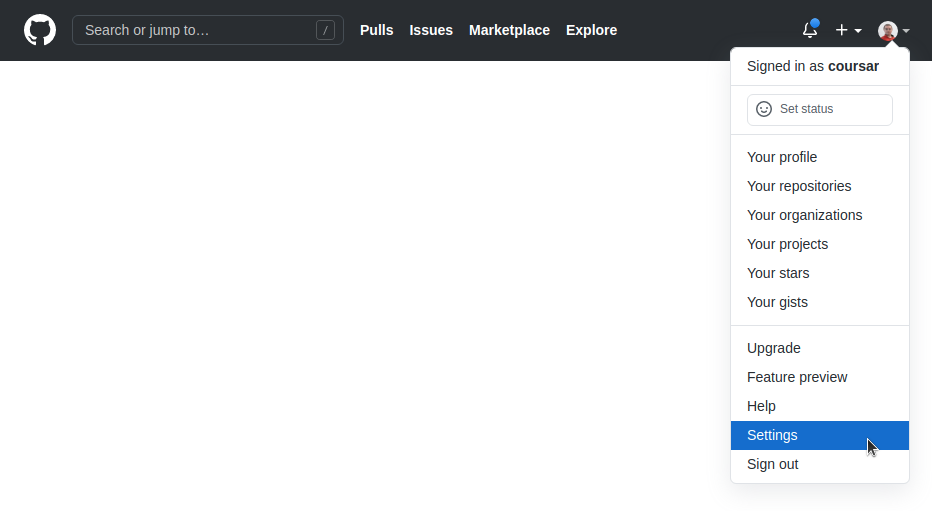

2\. Перейдите в пункт Developer Settings:

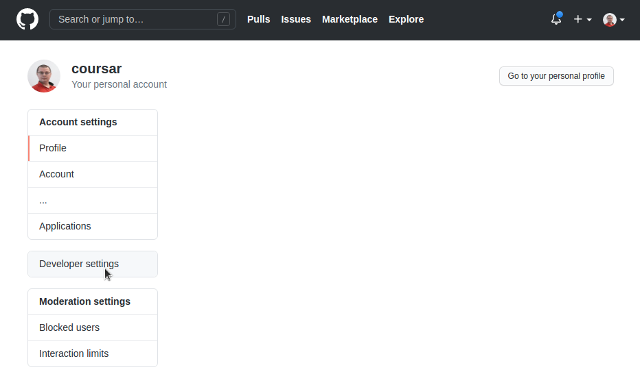

3\. Перейдите в пункт Personal access tokens:

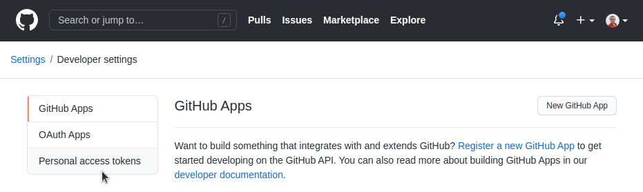

4\. Нажмите на кнопку Generate new token (вас могут попросить ввести пароль от вашего аккаунта для подтверждения действий):

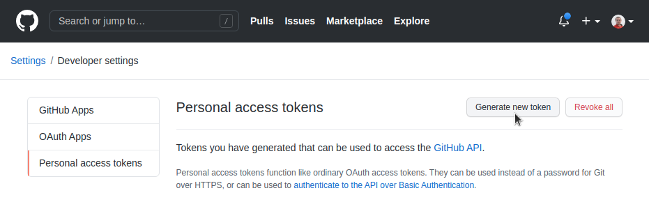

5\. Заполните поля как на скриншоте (Note и флажки напротив `write:packages` и `delete:packages` - остальные проставятся автоматически) и нажмите кнопк Generate Token:

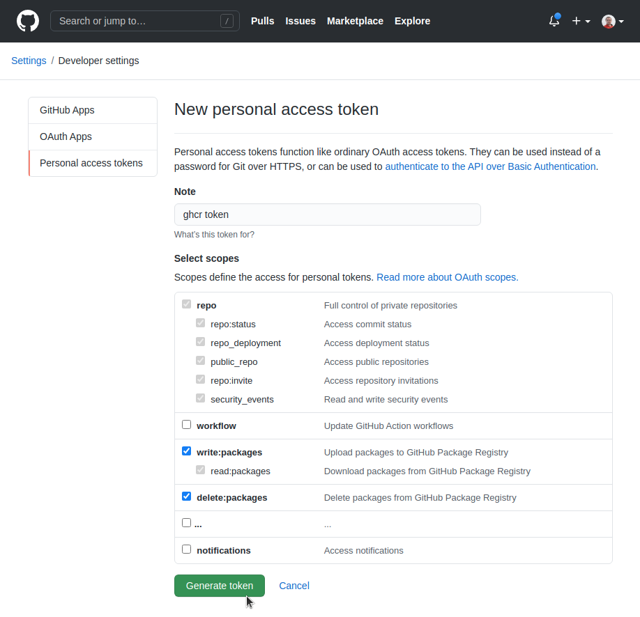

6\. Убедитесь, что вы скопировали токен (он будет показан всего один раз - если не "успели", то удалите старый и создайте новый):

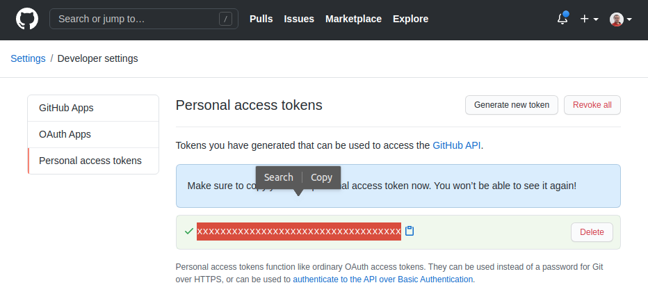

7\. Перейдите в настройки вашего репозитория (в который вы будете заливать свой код):

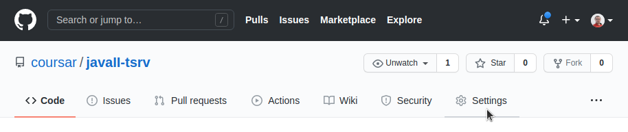

8\. Перейдите в пункт Secrets и нажмите на кнопку New repository secret:

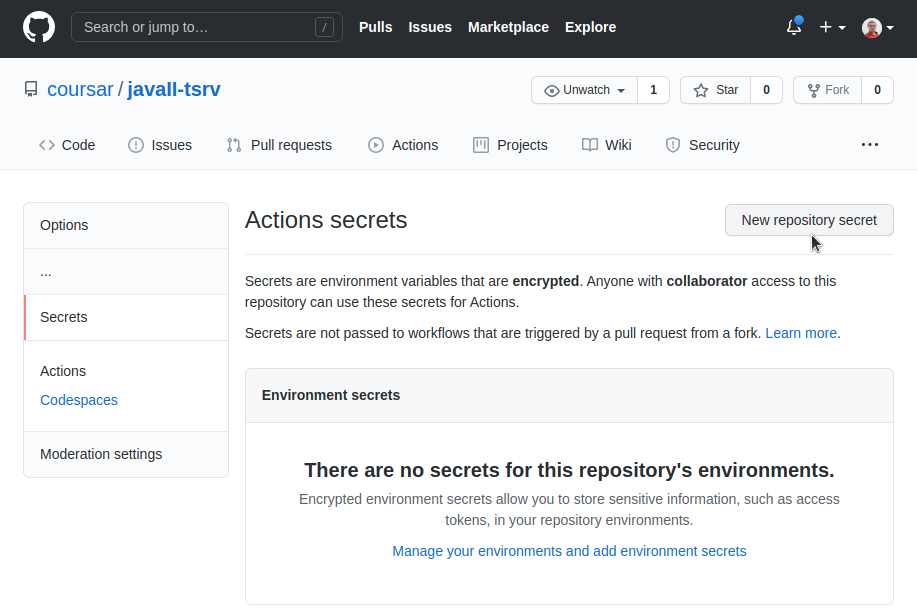

9\. В поле Name введите `GHCR_TOKEN`, в поле Value - ваш токен и нажмите на кнопку Add secret:

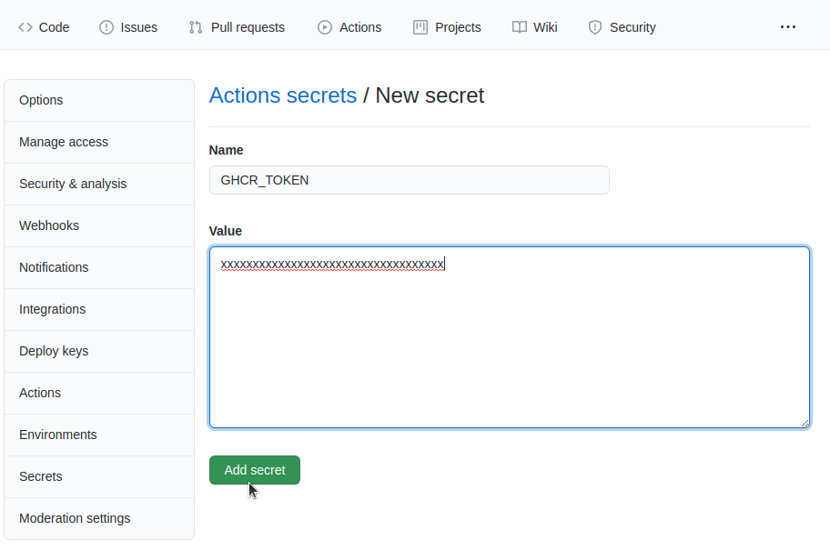

10\. В настройках профиля перейдите на вкладку Feature Preview:

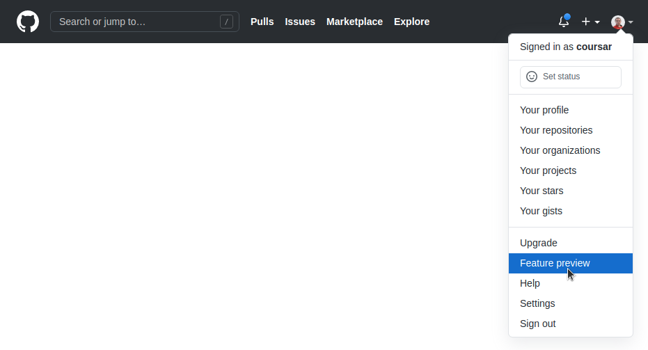

11\. Включите Imporved container support:

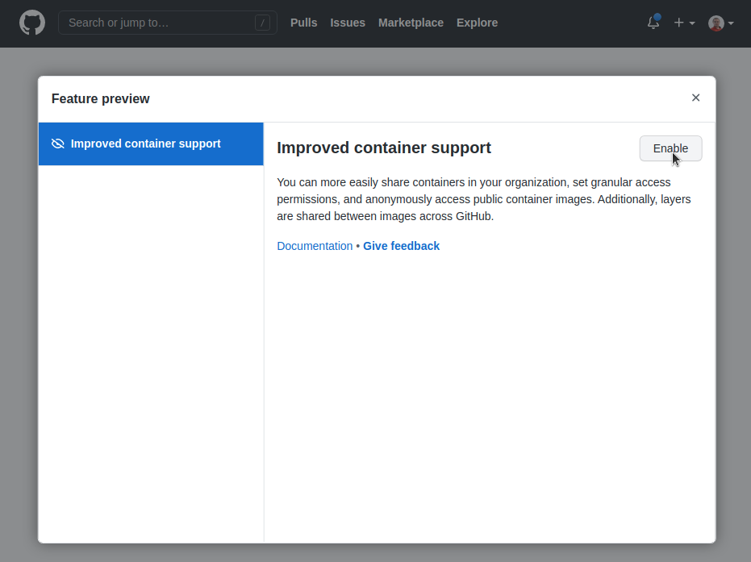

12\. Сделайте push (отправьте ваши исходники вместе с `.github/workflows/build.yml` на GitHub)

13\. Если вы всё сделали правильно, то после push (возможно через пару десятков секунд) в разделе Actions увидите запущенную сборку:

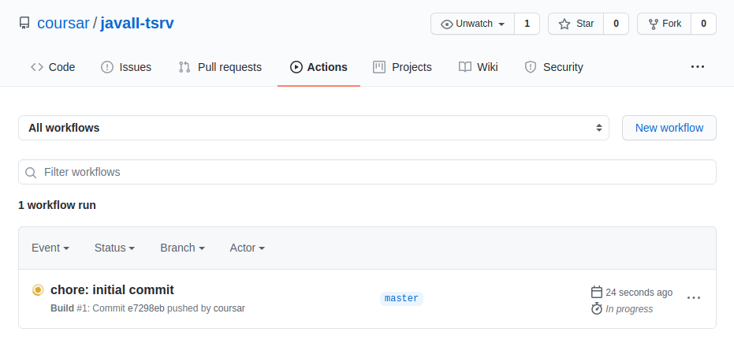

14\. Заходите на главную страницу своего профиля, переходите на вкладку Packages, выбираете нужный и нажимаете Package Settings:

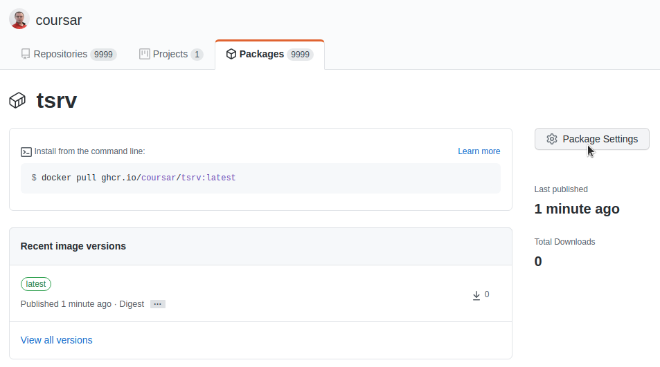

15\. Нажимаете кнопку Change Visibility и меняете на public:

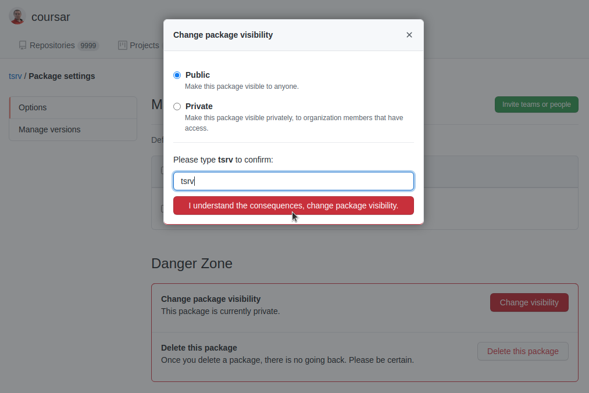

16\. Локально запускаете команду: `docker pull ghcr.io/ВАШ_ЛОГИН/ИМЯ_ОБРАЗА:latest`

Если всё скачивается и запускается - значит, всё у вас получилось. Добавляете меня в коллабораторы (если не знаете, как это делать - см. видео по GitHub в материалах).

P.S. все остальные проекты нужно будет выкладывать так же (публичными делать не обязательно).
